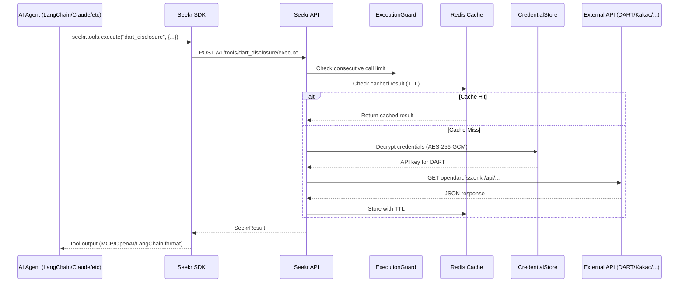
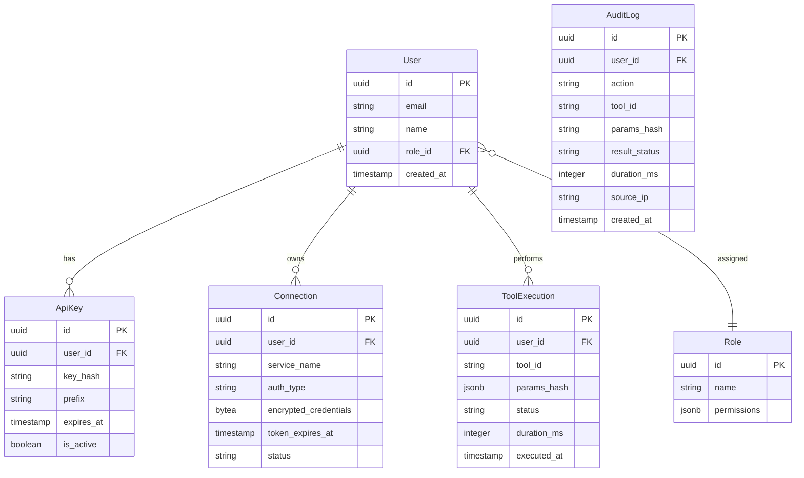

# Seekr — AI Agent Tool Execution Infrastructure for Korea

> Korean Composio + Self-hosting | Apache 2.0 | FastAPI + PostgreSQL + Redis + Docker
> Phase 0 준비 중 | Python 3.12+ | MCP Standard

---

## Problem

| Pain Point | 근거 | Seekr 해답 |
|---|---|---|
| 한국 SaaS 에이전트 통합 0개 | 오픈소스 20개 분석 — DART, 카카오톡, 네이버웍스, 토스, 쿠팡 지원 프레임워크 없음 | 한국 서비스 5개 + 글로벌 2개 네이티브 통합 |
| Composio는 클라우드 전용, PIPA 불가 | 모든 자격증명이 Composio 클라우드 경유, 셀프호스팅 미지원 | `docker compose up` 원커맨드 셀프호스팅 |
| 프레임워크 종속 도구 재작성 | 17/20 프레임워크가 LLM 호환성 문제 보유 | MCP 표준 + 프레임워크 비종속 ToolRegistry |

---

## Architecture

```
┌───────────────────────────────────────────────────────┐
│  Developer Interface                                   │
│  Python SDK (PyPI) │ MCP Server │ Playground UI        │
├───────────────────────────────────────────────────────┤
│  Seekr Core Engine (FastAPI, Stateless)                │
│  Auth → RBAC → Validate → Cache → Guard →             │
│  Inject Credentials → API Call → Compress → Audit Log  │
├───────────────────────────────────────────────────────┤
│  Tool Registry                                         │
│  KR: DART, KakaoTalk, Naver Works, Toss, Coupang      │
│  Global: GitHub, Gmail                                 │
├───────────────────────────────────────────────────────┤
│  Infra: PostgreSQL │ Redis │ Docker Compose            │
└───────────────────────────────────────────────────────┘
```

### Tool Execution Flow



---

## Tech Stack

| Layer | 선택 | 근거 |
|---|---|---|
| Runtime | Python 3.12+ / FastAPI | async, Pydantic native, 한국 채택률 높음 |
| SDK | Python (`seekr` on PyPI) | Composio 패턴; TS는 Phase 3+ |
| Database | PostgreSQL + Alembic | 엔터프라이즈 표준, pgvector 확장 가능 |
| Cache | Redis | TTL 캐시, 레이트 리밋, 세션 |
| Protocol | MCP (Model Context Protocol) | 프레임워크 비종속 핵심 차별화 |
| Encryption | AES-256-GCM | 자격증명 암호화 at rest |
| Observability | OpenTelemetry + Jaeger | 벤더 중립 분산 트레이싱 |
| Container | Docker Compose | 원커맨드 셀프호스팅 |
| CI/CD | GitHub Actions | ruff + mypy + pytest + auto PyPI deploy |
| Package | uv + pyproject.toml | 모던 Python 패키징 |

---

## Directory Structure

```
seekr/
├── seekr/
│   ├── core/                  # 엔진: 레지스트리, 실행기, 가드, 캐시, 압축기
│   │   ├── registry.py        # ToolRegistry — 도구 등록/검색/스키마 내보내기
│   │   ├── executor.py        # 도구 실행 파이프라인
│   │   ├── guard.py           # ExecutionGuard — 연속 호출 감지/차단
│   │   ├── cache.py           # ToolResultCache (Redis TTL)
│   │   └── compressor.py      # ResultCompressor
│   ├── auth/                  # 인증 & 자격증명 관리
│   │   ├── api_key.py         # API Key 생성/검증
│   │   ├── credential_store.py # AES-256-GCM 암호화 자격증명 저장
│   │   ├── oauth2.py          # OAuth2 엔진 (인가, 콜백, 리프레시)
│   │   └── rbac.py            # Role-based Access Control
│   ├── tools/                 # 도구 구현체
│   │   ├── base.py            # BaseTool, ToolDefinition
│   │   ├── dart/              # DART Open API (4 tools)
│   │   ├── kakao/             # KakaoTalk (3 tools)
│   │   ├── naver_works/       # Naver Works (4 tools)
│   │   ├── toss/              # Toss Payments (3 tools)
│   │   ├── coupang/           # Coupang Seller (3 tools)
│   │   ├── github/            # GitHub (4 tools)
│   │   └── gmail/             # Gmail (3 tools)
│   ├── mcp/                   # MCP 서버
│   │   ├── server.py          # 통합 MCP 서버 (전체 도구)
│   │   └── standalone/        # 서비스별 독립 MCP 서버
│   ├── sdk/                   # Python SDK (PyPI 배포)
│   │   ├── client.py          # Seekr() 메인 클라이언트
│   │   ├── adapters/          # to_langchain_tools(), to_pydanticai_tools()
│   │   └── errors.py          # SeekrError 계층
│   ├── api/                   # FastAPI 라우트
│   │   ├── v1/                # /v1/ 버전 엔드포인트
│   │   ├── middleware/        # Auth, CORS, rate limiting
│   │   └── deps.py            # Dependency injection
│   ├── audit/                 # 감사 로그 + 비용 추적
│   ├── infra/                 # SafeHttpClient, OpenTelemetry
│   └── models/                # SQLAlchemy + Pydantic 모델
├── tests/                     # pytest (unit + integration + e2e)
├── docs/                      # MkDocs Material
├── examples/                  # 예제 3개 (DART agent, 자동화, MCP)
├── docker/                    # Dockerfile + docker-compose.yml
├── scripts/                   # dev.sh, migrate.sh
├── pyproject.toml
└── .github/workflows/         # CI/CD
```

---

## API Design

| Method | Endpoint | 설명 | Auth |
|---|---|---|---|
| `GET` | `/v1/tools` | 사용 가능한 도구 목록 | API Key |
| `GET` | `/v1/tools/{tool_id}` | 도구 스키마 (파라미터, 반환값) | API Key |
| `POST` | `/v1/tools/{tool_id}/execute` | 도구 실행 | API Key + Credential |
| `GET` | `/v1/connections` | 연결된 계정 목록 | API Key |
| `POST` | `/v1/connections` | 연결 생성 (API key 또는 OAuth 시작) | API Key |
| `DELETE` | `/v1/connections/{id}` | 연결 제거 | API Key |
| `GET` | `/v1/auth/oauth2/authorize` | OAuth2 플로우 시작 | API Key |
| `GET` | `/v1/auth/oauth2/callback` | OAuth2 콜백 핸들러 | — |
| `GET` | `/v1/audit/logs` | 감사 로그 조회 | API Key + Admin |
| `GET` | `/v1/usage` | 사용량 & 비용 요약 | API Key |
| `GET` | `/health` | 헬스 체크 | — |
| `GET` | `/ready` | 준비 상태 (DB + Redis) | — |

### 실행 요청/응답 예시

```json
// POST /v1/tools/dart_disclosure/execute
// Header: X-API-Key: sk_seekr_...
{
  "params": {
    "corp_name": "삼성전자",
    "bgn_de": "20260101",
    "end_de": "20260307"
  }
}
```

```json
// Response 200
{
  "status": "success",
  "tool_id": "dart_disclosure",
  "result": {
    "disclosures": [
      {
        "rcept_no": "20260305000123",
        "corp_name": "삼성전자",
        "report_nm": "사업보고서 (2025.12)",
        "rcept_dt": "20260305"
      }
    ]
  },
  "metadata": {
    "cached": false,
    "execution_time_ms": 342,
    "cost": { "api_calls": 1 }
  }
}
```

---

## Data Model



---

## Deployment

| 항목 | Self-Hosted | Cloud (SaaS) |
|---|---|---|
| 설치 | `docker compose up` | seekr.dev 가입 |
| 데이터 위치 | 자체 인프라 | Seekr Cloud (서울 리전) |
| PIPA 준수 | 완전 통제 | Seekr 관리 |
| 적합 대상 | 규제 기업, 금융, 의료 | 스타트업, 개인 개발자 |
| 비용 | 무료 (Apache 2.0) | 사용량 기반 과금 |
| 자격증명 | 자체 암호화 저장 | KMS 봉투 암호화 |

---

## Quick Start

```python
from seekr import Seekr

seekr = Seekr(api_key="sk_seekr_...")
seekr.connections.create("dart", credentials={"api_key": "YOUR_DART_KEY"})

result = seekr.tools.execute("dart_disclosure", corp_name="삼성전자")
print(result.data)  # 삼성전자 최근 공시 목록

# LangChain 연동
tools = seekr.to_langchain_tools()
```

---

## Timeline

```
W1-3  ████████████  Phase 0: DART + 카카오 + 네이버웍스 MCP + Core Engine + Docker
W4-6  ████████████  Phase 1: Python SDK (PyPI) + OAuth2 + GitHub/Gmail + 토스/쿠팡
W7-8  ████████      Phase 2: 캐싱 + RBAC + 감사로그 + 테스트 80%+ + CI/CD
W9-10 ████████      Phase 3: 예제 3개 + Playground UI + 문서 + v1.0.0
```

총 10주, 400시간 | 상세 일정: [seekr-dev-schedule.md](seekr-dev-schedule.md)

---

## Design Principles

| 공통 문제 (20개 분석) | 빈도 | Seekr 전략 |
|---|---|---|
| 무한 루프 | 14/20 | `ExecutionGuard` — 연속 호출 감지/차단 |
| 토큰 비용 폭발 | 16/20 | Redis TTL 캐시 + 결과 압축 + 비용 대시보드 |
| 보안 취약점 | 8/20 | 코드 실행 없음, `SafeHttpClient`, Pydantic 검증 |
| 메모리 누수 | 10/20 | 무상태 서버, 요청 스코프 GC, 외부 DB |
| LLM 비호환 | 17/20 | LLM 비호출 원칙, ToolRegistry 다중 스키마 |
| 프로덕션 미비 | 15/20 | Day 1: 감사 로그, RBAC, OpenTelemetry, `/health` |
| 브레이킹 체인지 | 12/20 | SemVer + `/v1/` API 버전 + Deprecation 정책 |

---

## Security

보안 아키텍처 상세: [seekr-security.md](seekr-security.md)
